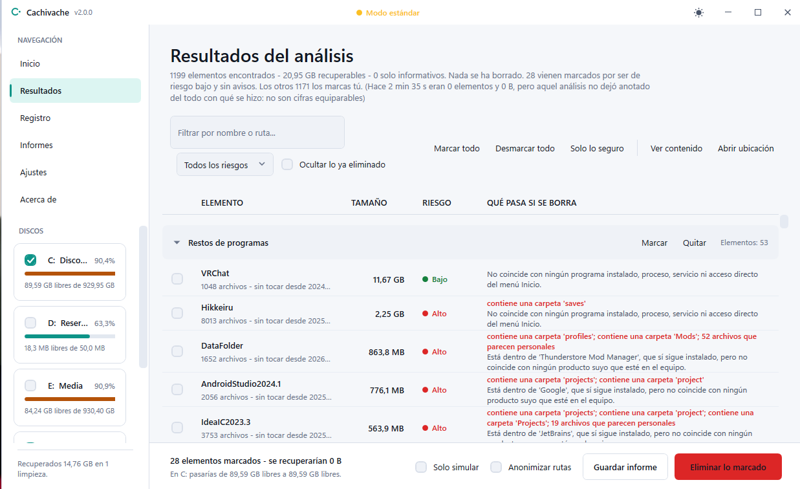
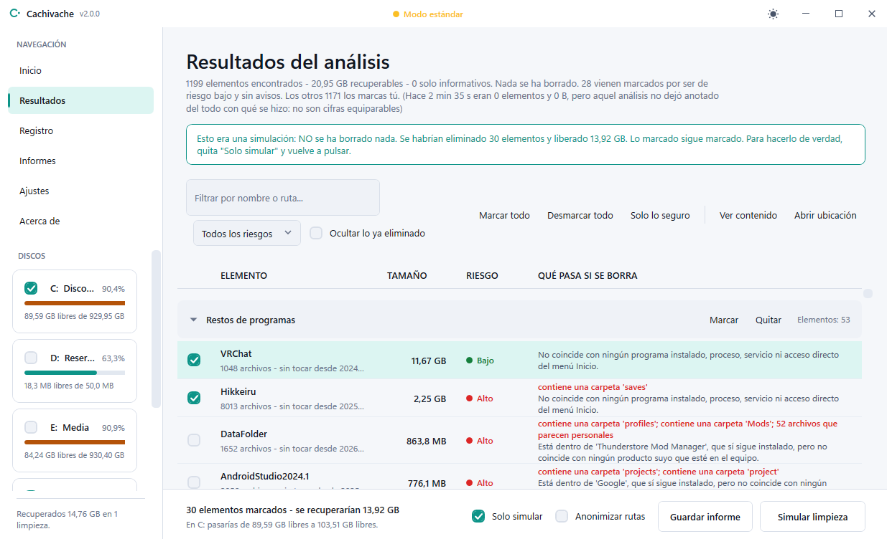
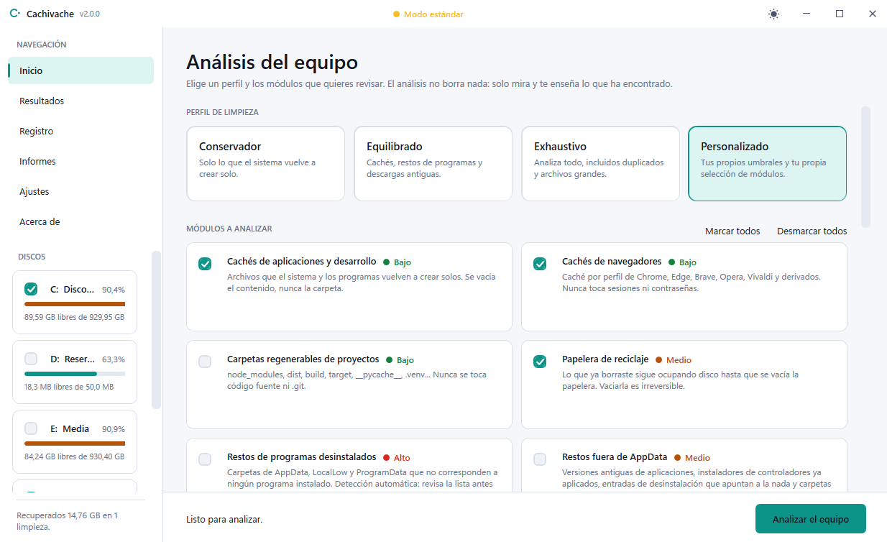

<p align="center">
  
</p>

<h1 align="center">Cachivache</h1>

<p align="center">
  <strong>Libera espacio en Windows sin romper nada.</strong><br>
  Analiza el equipo, te explica qué ha encontrado y qué pasa si lo borras, y solo toca lo que tú marques.
</p>

<p align="center">
  <a href="https://github.com/soypacodev/cachivache/releases/latest"></a>
  <a href="https://github.com/soypacodev/cachivache/actions/workflows/ci.yml"></a>
  
  
  
  <a href="LICENSE"></a>
</p>

<p align="center">
  <a href="#empezar"><strong>Descargar</strong></a> ·
  <a href="#pruébalo-sin-que-borre-nada">Probar sin riesgo</a> ·
  <a href="#cómo-evita-romper-el-equipo">Seguridad</a> ·
  <a href="#qué-analiza">Módulos</a> ·
  <a href="docs/ARQUITECTURA.md">Arquitectura</a>
</p>

<p align="center">
  <picture>
    <source media="(prefers-color-scheme: dark)" srcset="docs/capturas/resultados-oscuro.png">
    
  </picture>
</p>

---

## Por qué otro limpiador

La mayoría de los limpiadores piden un acto de fe: pulsas un botón, se llenan unas barras y te dicen que has recuperado 12 GB. Qué eran esos 12 GB, nadie lo sabe.

Cachivache funciona al revés. **Cada elemento que propone dice qué es, cuánto ocupa y qué pasa exactamente si lo borras.** Nada se borra sin que lo marques, nada arriesgado viene marcado de fábrica y todo queda registrado.

| | Limpiador típico | Cachivache |
|---|---|---|
| **Qué borra** | Una barra de progreso y un total | Cada elemento con su explicación, su tamaño y su riesgo |
| **Criterio de seguridad** | Lista de cosas a evitar | **Lista blanca**: solo se puede borrar lo que cuelga de una carpeta autorizada |
| **Dónde va lo borrado** | Normalmente, desaparece | **A la papelera** por defecto; el borrado permanente se activa a propósito |
| **Antes de borrar** | Se fía del análisis | **Vuelve a comprobar** cada ruta justo antes de tocarla |
| **Probar sin riesgo** | No siempre | **Modo simulación**: recorre todo lo que haría sin tocar un archivo |
| **Registro de Windows** | Suele "limpiarlo" | **No lo toca nunca** |
| **Conexión a internet** | Telemetría, anuncios, actualizaciones automáticas | **Ninguna**, salvo que pulses *Buscar actualización* |
| **Instalación** | Instalador con extras | Un `.zip`. Sin dependencias: PowerShell y WPF ya vienen con Windows |
| **Código** | Cerrado | Abierto, legible y con **más de 2.300 pruebas automáticas** |

---

## Empezar

**Requisitos:** Windows 10 u 11. Nada más: PowerShell 5.1 ya viene con el sistema.

### Opción A — Descargar (recomendado)

1. Descarga el `.zip` de la [**última versión**](https://github.com/soypacodev/cachivache/releases/latest).
2. Descomprímelo.
3. Abre **`Cachivache.exe`**.

Cada versión publica el **SHA-256** de sus archivos en la propia página de la versión y en `SHA256SUMS.txt`. Para comprobar que tu descarga es la publicada:

```powershell
Get-FileHash .\Cachivache-v2.0.0.zip -Algorithm SHA256
```

### Opción B — Con Scoop

```powershell
scoop install https://github.com/soypacodev/cachivache/releases/latest/download/cachivache.json
```

Cada versión adjunta también sus manifiestos de **winget**, pero el paquete **todavía no está publicado** en `microsoft/winget-pkgs`, así que `winget install` aún no lo encuentra. Detalles en [`packaging/README.md`](packaging/README.md).

### Opción C — Desde el código

```powershell
git clone https://github.com/soypacodev/cachivache.git
cd cachivache
.\Cachivache.bat
```

`Cachivache.bat` deja una consola abierta detrás, útil para ver cualquier error en el primer arranque. Si prefieres el lanzador sin consola, ejecuta `tools\Crear-ejecutable.bat` una vez y aparecerá `Cachivache.exe`, compilado con el compilador de C# que ya trae Windows.

<details>
<summary><strong>Si algo no funciona</strong></summary>

<br>

- **"La ejecución de scripts está deshabilitada".** Es la política de ejecución de PowerShell. Los lanzadores ya la tienen en cuenta; si llamas al `.ps1` a mano, usa `powershell -ExecutionPolicy Bypass -File .\Cachivache.ps1`.
- **"Windows protegió su PC" al abrir el `.exe`.** Es SmartScreen: el ejecutable no está firmado digitalmente. Puedes compilarlo tú con `tools\Crear-ejecutable.bat` o usar `Cachivache.bat`.
- **El `.exe` no se crea.** La ventana de `Crear-ejecutable.bat` se queda abierta y muestra el error. Las causas habituales son el *Acceso controlado a carpetas* de Windows Defender (si el proyecto está en Escritorio o Documentos) o un antivirus que retiene el `.exe` nuevo.
- **Algo se comporta raro.** `.\Cachivache.ps1 -Diagnostico` genera un resumen del entorno, con las rutas personales anonimizadas, listo para pegar en una [incidencia](https://github.com/soypacodev/cachivache/issues).

</details>

> **Se abre sin permisos de administrador a propósito.** Los cuatro módulos que los necesitan (`logs`, `windowsupdate`, `componentes` y `perfiles`) aparecen desactivados hasta que pulses *Ajustes → Reiniciar como administrador*.

---

## Pruébalo sin que borre nada

Antes de confiar en un limpiador, mira lo que haría.

- **En la ventana:** analiza y, antes de eliminar, marca **Solo simular**. El botón pasa a decir *Simular limpieza*.
- **En la consola:** `.\Cachivache.ps1 -Consola -Ejecutar -Simular`

La simulación pasa por **las mismas comprobaciones que un borrado real**, te dice cuánto espacio liberaría y lo anota en el registro, **sin tocar un solo archivo**. Si algo de lo que propone te sorprende, [abre una incidencia](https://github.com/soypacodev/cachivache/issues): un falso positivo es la información más valiosa para este proyecto.

<p align="center">
  <picture>
    <source media="(prefers-color-scheme: dark)" srcset="docs/capturas/simulacion-oscuro.png">
    
  </picture>
</p>

---

## Cómo se usa

1. **Elige un perfil.** *Conservador* solo toca lo que el sistema regenera solo. *Equilibrado* añade restos de programas y descargas antiguas. *Exhaustivo* lo analiza todo, incluidos los duplicados.
2. **Pulsa Analizar.** El análisis es de solo lectura, corre en segundo plano y se puede cancelar en cualquier momento.
3. **Revisa los resultados.** Agrupados por categoría, con etiqueta de riesgo y explicación. Lo que lleva aviso sale sin marcar.
4. **Elimina.** Todo va a la papelera salvo que actives el borrado permanente. Si hay algo de riesgo medio o alto marcado, hay que escribir `ELIMINAR` para confirmar.

<p align="center">
  <picture>
    <source media="(prefers-color-scheme: dark)" srcset="docs/capturas/inicio-oscuro.png">
    
  </picture>
</p>

| Tecla | Acción |
|---|---|
| `F5` | Analizar |
| `Ctrl+F` | Filtrar resultados |
| `Ctrl+A` | Marcar todo lo visible |
| `Esc` | Cancelar el análisis o detener la eliminación |
| `Ctrl+1` … `Ctrl+6` | Cambiar de panel |

`Supr` **no** elimina, a propósito: borrar es un gesto deliberado que se hace desde su botón.

---

## Qué analiza

**21 módulos independientes.** Los marcados como *solo informa* nunca borran: te enseñan dónde se va el disco y cómo recuperarlo desde el propio Windows.

| Módulo | Qué busca | Riesgo |
|---|---|---|
| `caches` | Cachés de npm, Gradle, pip, NuGet, Cargo, shaders, Discord, Spotify, VS Code, Adobe… | Bajo |
| `navegadores` | Caché de Chrome, Edge, Brave, Opera, Vivaldi, Yandex y Chromium, perfil por perfil | Bajo |
| `proyectos` | `node_modules`, `dist`, `__pycache__`, `.venv` y otras carpetas regenerables | Bajo |
| `papelera` | La papelera de las unidades seleccionadas | Medio |
| `restos` | Carpetas de AppData de programas que ya no están instalados | Alto |
| `restosregistro` | Versiones antiguas de apps Electron, instaladores de controladores y huérfanos de Archivos de programa | Medio |
| `juegos` | Cachés y descargas a medias de Steam, Epic, Battle.net, GOG, EA, Ubisoft y Riot; instalaciones huérfanas | Medio |
| `appsuwp` | Cachés de apps de la Store y carpetas de apps ya desinstaladas | Medio |
| `descargas` | Instaladores, ISOs y comprimidos antiguos en Descargas | Medio |
| `vacias` | Carpetas sin un solo archivo dentro | Bajo |
| `accesos` | Accesos directos cuyo destino ya no existe | Bajo |
| `temporales` | `.tmp`, `.bak`, autoguardados de Office, miniaturas | Bajo |
| `duplicados` | Archivos idénticos, comprobados por SHA-256 | Medio |
| `grandes` | Archivos grandes que no se abren desde hace tiempo · *solo informa* | Alto |
| `logs` | Registros CBS, DISM, Panther, WER y volcados de memoria · *admin* | Bajo |
| `windowsupdate` | Paquetes de actualización ya aplicados · *admin* | Bajo |
| `componentes` | Compactación de WinSxS mediante DISM · *admin* | Medio |
| `sistema` | `hiberfil.sys`, `pagefile.sys`, puntos de restauración · *solo informa* | Alto |
| `dockerwsl` | Discos virtuales de WSL y caché de Docker | Alto |
| `arranque` | Entradas de inicio, servicios y tareas rotas · *solo informa* | Medio |
| `perfiles` | Perfiles de usuario abandonados · *admin* · *solo informa* | Alto |

Ficha completa de cada módulo en [`docs/MODULOS.md`](docs/MODULOS.md).

---

## Cómo evita romper el equipo

Toda la decisión de *"¿se puede borrar esto?"* vive en un solo archivo, [`src/Core/Guard.ps1`](src/Core/Guard.ps1), para que se pueda auditar de una sentada.

**El modelo es de lista blanca.** Una ruta solo es borrable si cuelga de una carpeta que el módulo ha autorizado de forma explícita, y esa carpeta en sí nunca lo es. Además, cualquiera de estos filtros veta el borrado:

1. **Forma de la ruta:** raíces de unidad, rutas demasiado cortas, recursos de red y travesías con `..`.
2. **Rutas del sistema:** Windows, System32, WinSxS, Archivos de programa, ProgramData, la raíz de AppData y las carpetas personales, en cualquier idioma y con OneDrive. También cualquier carpeta que las *contenga*.
3. **Fragmentos prohibidos:** `driverstore`, `\microsoft\crypto\`, `\.ssh\`, `\.aws\`, `\microsoft\vault\`…
4. **Carpetas personales estén donde estén:** Documentos, Escritorio, Imágenes, Música o Vídeos, aunque estén en `D:\`.
5. **Copias de seguridad:** cualquier ruta que pase por una carpeta llamada `backup`.
6. **Extensiones personales:** documentos, fotos, vídeo, partidas guardadas, certificados y bases de datos de contraseñas. Solo el módulo de duplicados puede levantar este filtro, y únicamente cuando ha comprobado por hash que queda otra copia idéntica.
7. **Nombres sensibles** en los módulos de más riesgo: antivirus, gestores de contraseñas, monederos de criptomonedas, copias de seguridad, correo y banca.

Y tres decisiones de diseño igual de importantes:

- **Se revalida justo antes de borrar.** Que una ruta fuera segura durante el análisis no basta: si algo ha cambiado entre medias, se bloquea.
- **Nunca se sigue un enlace simbólico ni una unión.** Borrar a través de un enlace podría arrastrar un destino que está en cualquier otro sitio.
- **Se vacía el contenido, no la carpeta**, porque muchos programas fallan si su carpeta de caché desaparece.

**Lo que no hace, y no va a hacer:** escribir en el registro de Windows, desinstalar programas, tocar WinSxS a mano, borrar `Windows.old`, perfiles de usuario o puntos de restauración. Cuando algo de eso conviene, lo explica y te dice cómo hacerlo desde Windows.

**Privacidad:** el programa no se conecta a internet por su cuenta ni envía telemetría. La única conexión es el botón *Buscar si hay una versión nueva*, que consulta `api.github.com` solo cuando lo pulsas. Una prueba automática impide que aparezca otra salida de red en el código.

Las [pruebas de la guardia](tests/Guard.Tests.ps1) son la especificación ejecutable de todo esto.

---

## Modo consola

Para automatizar tareas o para quien prefiera la terminal:

```powershell
.\Cachivache.ps1 -Listar                                             # módulos disponibles
.\Cachivache.ps1 -Consola -Perfil conservador -Informe .\informe.html  # analizar y guardar informe
.\Cachivache.ps1 -Consola -Modulos caches,navegadores -Ejecutar        # vaciar solo esas cachés
.\Cachivache.ps1 -Consola -Excluir 'D:\Trabajo'                        # excluir una carpeta del análisis
.\Cachivache.ps1 -Espacio C:\ -Profundidad 3                           # dónde se va el espacio
.\Cachivache.ps1 -Espacio -Informe mapa.html                           # mapa del disco en HTML
```

En consola, `-Ejecutar` **solo elimina lo que el análisis marcó por su cuenta**: riesgo bajo y sin avisos. Lo que exige criterio humano nunca se borra sin un humano delante. Todos los parámetros: `Get-Help .\Cachivache.ps1 -Full`.

El modo `-Espacio` muestra el disco ordenado por tamaño, cuenta bien los **enlaces duros** (un archivo compartido por dos rutas ocupa una vez, no dos) y, con `-Informe`, genera un mapa en HTML que colorea cada carpeta según cuánto de su espacio se puede recuperar.

---

## Dónde guarda sus datos

Nada dentro de su propia carpeta, para que funcione desde una ubicación de solo lectura:

```
%LOCALAPPDATA%\Cachivache\
├── preferencias.json   ajustes, tema, perfil y exclusiones
├── historial.json      las últimas 100 ejecuciones
├── registros\          un .log por mes
└── informes\           informes HTML, CSV y JSON de cada análisis
```

---

## Cómo está hecho

- **PowerShell 5.1 + WPF**, sin dependencias externas. La interfaz está partida en un `.xaml` por panel, con tema claro y oscuro.
- **Arquitectura de módulos:** añadir una categoría de limpieza es dejar un archivo en `src/Modules/`. El registro los descubre solo, sin listas centrales que mantener.
- **Interfaz que nunca se congela:** el análisis y la eliminación corren en *runspaces* aparte y se comunican con la ventana mediante una tabla sincronizada.
- **Más de 2.300 pruebas Pester**, análisis estático con PSScriptAnalyzer y un suelo de cobertura, ejecutados en cada push en Windows con PowerShell 5.1 y 7.
- **Banco de pruebas real en la CI:** un runner de Windows monta un árbol de archivos trampa y ejecuta una limpieza de verdad para comprobar que no se toca nada que no se deba.
- **Publicación reproducible:** el `.exe`, el `.zip`, las sumas SHA-256 y los manifiestos de Scoop y winget los genera GitHub Actions a partir del código etiquetado. Por eso el `.exe` no está en el repositorio.

```
Cachivache.ps1     punto de entrada (ventana y consola)
src/Core/          guardia de seguridad, motor de borrado, disco, informes, registro…
src/Modules/       un archivo por categoría de limpieza
src/UI/            ventana WPF: paneles XAML, temas y lógica
src/Cli/           modo consola
tests/             suite de Pester
tools/             pruebas, lanzador, banco de pruebas y publicación
docs/              arquitectura, módulos y guías de prueba
```

Más detalle en [`docs/ARQUITECTURA.md`](docs/ARQUITECTURA.md) y [`docs/ESTRUCTURA.md`](docs/ESTRUCTURA.md).

### Desarrollo

```powershell
.\tools\Probar.ps1          # suite completa, analizador y cobertura
.\tools\Probar.ps1 -Rapido  # sin medir cobertura, para iterar
```

Cómo contribuir en [`CONTRIBUTING.md`](CONTRIBUTING.md). Para reportar un problema de seguridad, sigue [`SECURITY.md`](SECURITY.md).

---

## Licencia

[MIT](LICENSE). Puedes usarlo, modificarlo y distribuirlo libremente conservando el aviso de copyright.

Se ofrece **sin garantía de ningún tipo**, y en un programa que borra archivos eso importa: empieza por el perfil conservador, usa la simulación y ten copia de seguridad de lo que no puedas permitirte perder.

<p align="center"><sub>Hecho en Málaga por <a href="https://github.com/soypacodev">Paco López</a>.</sub></p>
